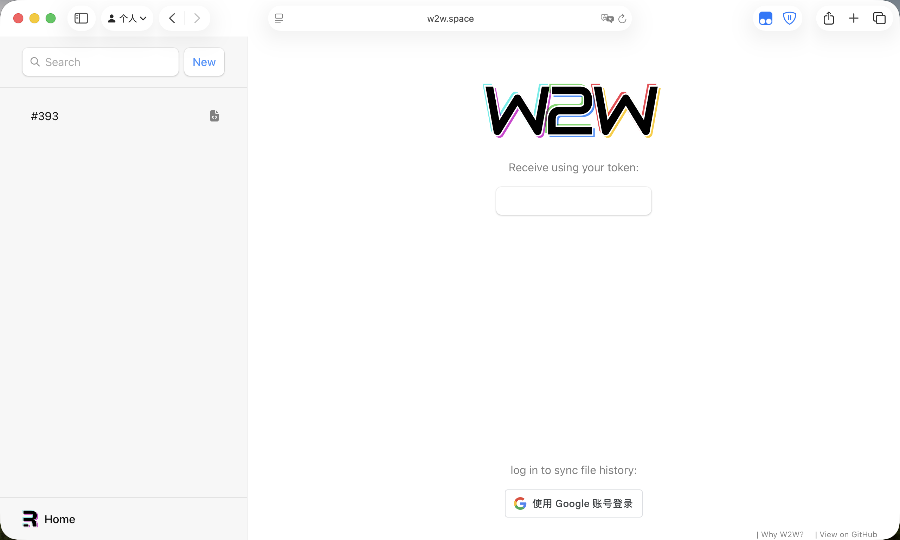
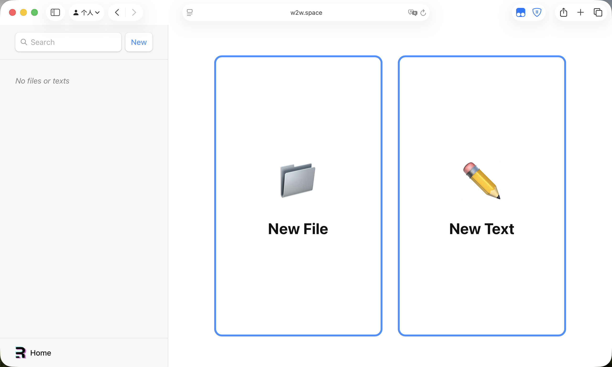
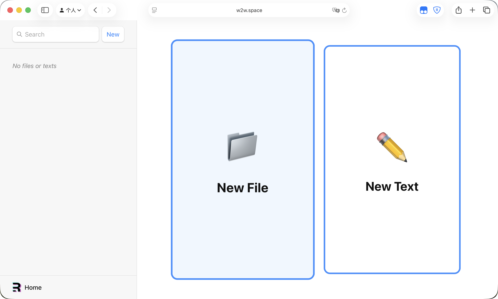
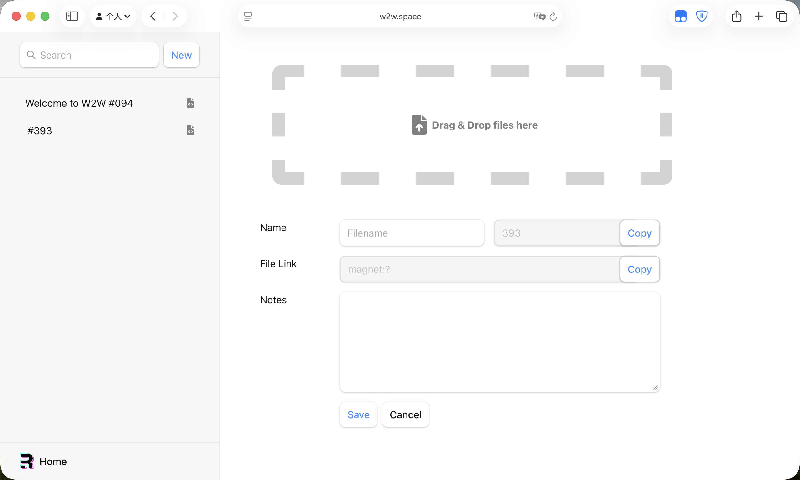
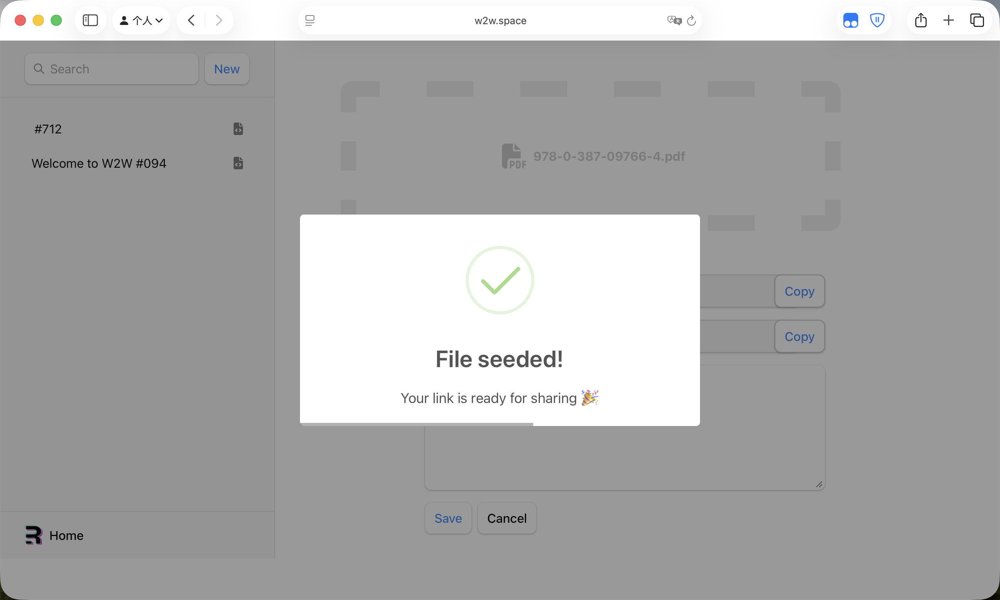
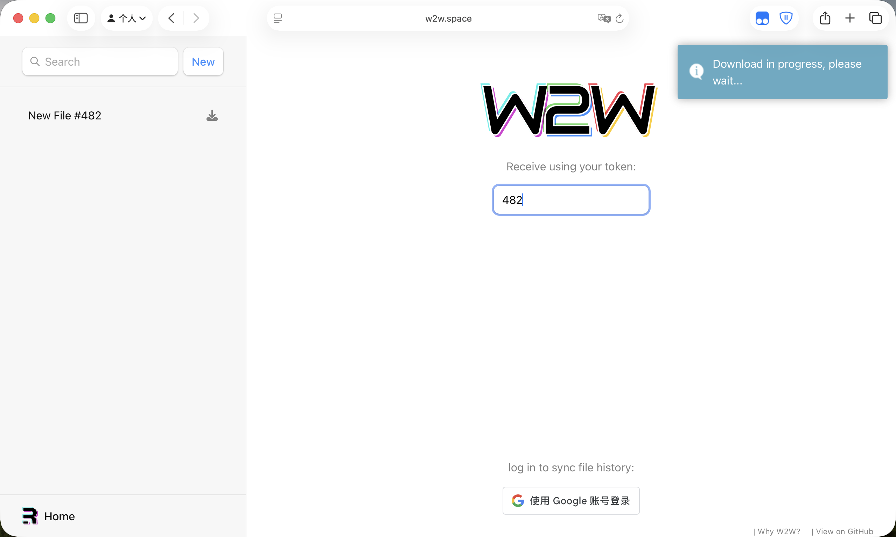
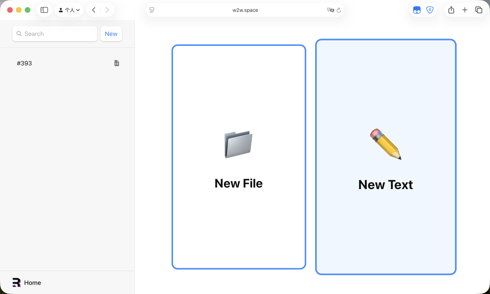
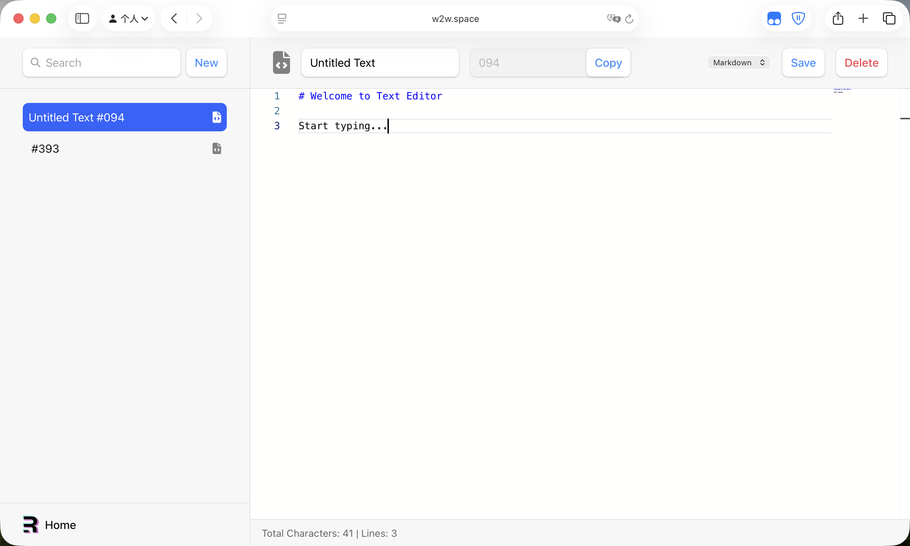
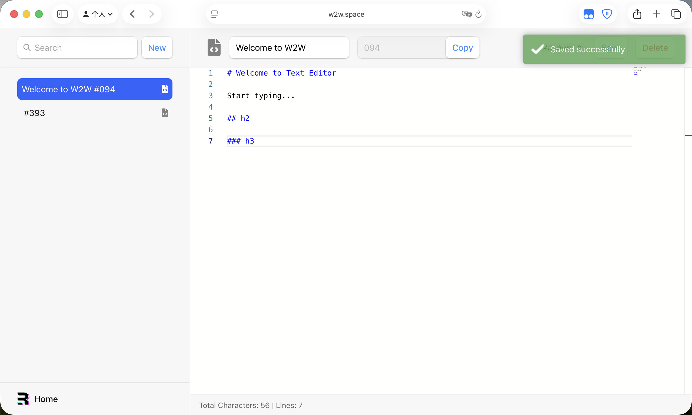
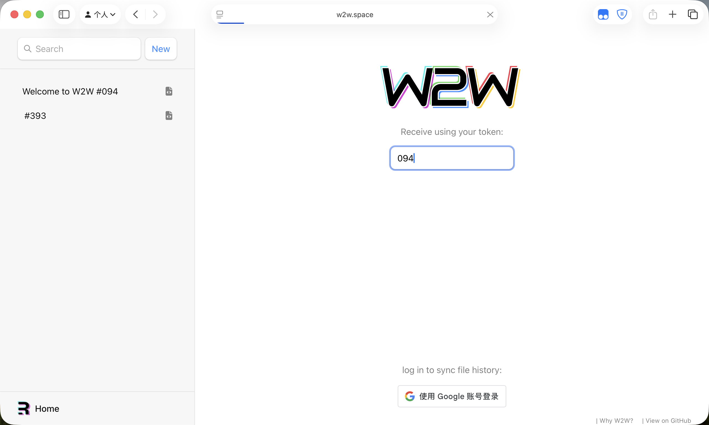

# 🌐 WebToWeb (W2W)

> A browser-based P2P file sharing application built with Remix and WebTorrent



**WebToWeb** is a secure, fast, and anonymous browser-based file sharing platform that enables direct peer-to-peer file transfers without requiring users to log in to any service or upload files to third-party servers.

🔗 **Live Demo**: [w2w.space](https://w2w.space/)

---

## ✨ Features

- 🚀 **Fast P2P Transfer**: Direct peer-to-peer file sharing using WebTorrent protocol
- 🔒 **Privacy-First**: No login required, no files stored on servers
- 💾 **Large File Support**: No file size limitations
- 🔑 **Token-Based Access**: Simple 6-digit token for secure file access
- 🎨 **Modern UI**: Clean and intuitive user interface built with Remix
- ⚡ **Real-Time Progress**: Live transfer progress with peer information
- 🌍 **Browser-Based**: Works in all modern browsers (Chrome, Firefox, Safari, Edge)

---

## 🎯 Use Cases

Perfect for transferring files to public computers:

- **University Labs**: Share files without logging into cloud services
- **Library Computers**: Transfer files securely without accounts
- **Classroom Presentations**: Quick file sharing during presentations
- **Temporary File Exchange**: One-time secure file transfers

**Why WebToWeb over alternatives?**

✅ **No Login Required** - Keep your accounts safe  
✅ **No File Storage** - Direct P2P transfer, no third-party servers  
✅ **No Upload Wait** - Download starts immediately  
✅ **No Size Limits** - Transfer files of any size  
✅ **No Speed Limits** - Full bandwidth utilization  
✅ **Short Tokens** - Simple 6-digit codes instead of long URLs

---

## 📸 Screenshots

<details>
<summary>📊 Dashboard</summary>

Users can view all their files in a clean, organized dashboard with quick actions.


</details>

<details>
<summary>🔄 Two-Way Sharing</summary>

File or text can be shared with a single click, providing seamless peer-to-peer transfer.



</details>

<details>
<summary>📄 File Sharing</summary>

#### New File

Create new files for sharing with built-in editor.



#### Seed File

Seed the file to the P2P network



..and get a token



#### Download File

Get files by entering the token code.



<!-- TODO: add download screenshot -->
<!-- ..and downloaded -->

</details>

<details>
<summary>📝 Text Sharing</summary>

#### New Text

Create and share text snippets instantly.



#### Edit Text

Full-featured VS Code's editor ([Monaco Editor](https://github.com/microsoft/monaco-editor)) embedded in browser.



#### Save Text

Save text with real-time confirmation.



#### Retrieve Text

Retrieve text by entering the token code.



</details>

---

## 🚀 Quick Start

### Prerequisites

- Node.js 20+
- Redis server
- Docker (for containerized deployment)

### Local Development

```bash
# Clone the repository
git clone https://github.com/yourusername/CSCC09-24F-Project.git
cd CSCC09-24F-Project

# Start Redis
redis-server remix/app/redis.windows.conf

# Install dependencies
cd remix
npm install

# Start development server
npm run dev
```

The application will be available at `http://localhost:3000`

### Deployment

Deploy using the automated script:

```bash
./deploy.sh
```

Or manually:

```bash
# Build and push Docker image
cd remix
docker buildx build --platform=linux/amd64 -t zheyuanwei/w2w:latest --push .

# SSH to server and update
ssh user@server
cd ~/CSCC09-24F-Project/remix
docker-compose pull
docker-compose down
docker-compose up -d
```

---

## 🛠️ Tech Stack

- **Framework**: [Remix](https://remix.run/) - Full-stack web framework
- **P2P Engine**: [WebTorrent](https://github.com/webtorrent/webtorrent) - Peer-to-peer file sharing
- **Editor**: Monaco Editor - VS Code's editor embedded in browser
- **Database**: Redis - Fast, in-memory data store
- **OAuth**: Google OAuth 2.0 - Secure authentication
- **Styling**: CSS3 with custom design
- **Icons**: Font Awesome

---

## 📁 Project Structure

```
CSCC09-24F-Project/
├── remix/                    # Main application
│   ├── app/
│   │   ├── routes/          # Remix routes
│   │   └── utils/           # Server utilities
│   ├── public/              # Static assets
│   └── dockerfile           # Container configuration
├── deploy.sh                # Automated deployment script
└── img/                     # Screenshots and assets
```

---

## 📝 Available Scripts

- `npm run dev` - Start development server
- `npm run build` - Build for production
- `npm run start` - Start production server
- `./deploy.sh` - Automated deployment with timing

---

## ⚠️ Limitations

- **WebRTC Required**: Works in modern browsers (Chrome, Firefox, Safari, Edge, Opera)
- **Both Devices Online**: Requires both sender and receiver to be online simultaneously
- **Network Restrictions**: May not work on heavily firewalled networks (corporate, university networks)
- **Public Protocol**: Files are shared via public magnet links - use tokens for security
- **No Offline Storage**: Files are not stored permanently on the server

---

## 🤝 Contributing

Contributions are welcome! Please feel free to submit a Pull Request.

---

## 📄 License

This project is licensed under the MIT License.

---

## 🙏 Acknowledgments

This project was developed as part of the **CSCC09** course project at the **University of Toronto Scarborough (UTSC)**, under the supervision of **Prof. Thierry Sans**.

- Course: [CSCC09 - Web Development](https://thierrysans.me/CSCC09/)
- Institution: [UTSC](https://www.utsc.utoronto.ca/cms/)
- Professor: [Prof. Thierry Sans](https://thierrysans.me/)

---

<div align="center">
Made with ❤️ by the CSCC09 Team
</div>
